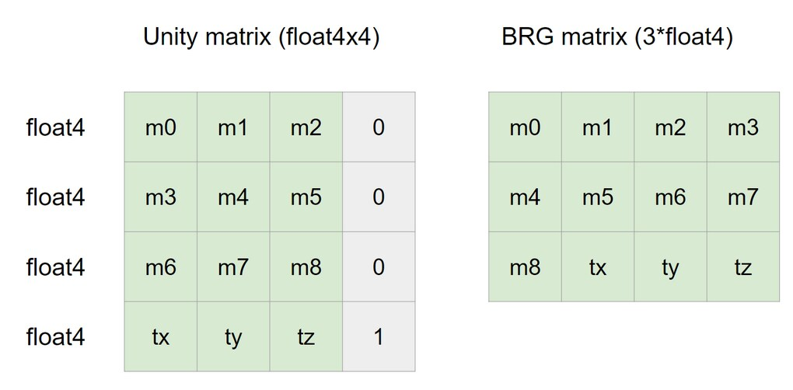

## About
What is **Batch Rendering Group** (BRG)? BatchRendererGroup is an API for high-performance custom rendering in projects that use a Scriptable Render Pipeline (SRP) and the SRP Batcher. 
BRG is the perfect tool to:
 - Render DOTS Entities. For example, Unity’s Hybrid Renderer uses BRG to do this.
 - Render a large number of environment objects where using individual GameObjects would be too resource-intensive. For example, procedurally-placed plants or rocks.
 - Render custom terrain patches. You can use different meshes or materials to display different levels of detail.

More information about BRG - https://docs.unity3d.com/Manual/batch-renderer-group.html.

The **Brg Container** provides high-level API for instancing data reading and writing. It supports UBO and SSBO buffer types, so it can be used for GLES.

Supports types of culling:
 - Frustum culling

## Dependencies
 - Unity Mathematics: 1.2.6
 - Unity Collections: 2.2.1
 - Unity Burst: 1.8.8

## How to install
From UPM:
 - install the package from git URL (https://github.com/LizzyFox-code/BrgContainer)
 - install the package from disk: download repo as zip archive, unpack and select the package.json file

## Samples
 - **Hello World** is a simple sample. It shows how to create the Brg Container and change data for each instance in a Job.

## Usage
#### Create the BatchRendererGroupContainer
First, we need to create the **BatchRendererGroupContainer** and set global bounds.
```c#
var bounds = new Bounds(new Vector3(0, 0, 0), new Vector3(1048576.0f, 1048576.0f, 1048576.0f));
m_BrgContainer = new BatchRendererGroupContainer(bounds);
```

#### Create the material properties description
For each batch we need to describe material properties (type and property id). A property id of material property can be get by Shader.PropertyToID method.
Please note, the material properties description needs only for batch description creating, so we need to dispose it.

P.S.: the batch contains 'objectToWorld' and 'worldToObject' matrices by default.
```c#
// for example let's create a description of the _BaseColor material property.
using var materialProperties = new NativeArray<MaterialProperty>(1, Allocator.Temp)
{
     [0] = MaterialProperty.Create<Color>(m_BaseColorPropertyId)
};
```

#### Create the batch description
After that, we need to create the batch description that needs max instance count and the material properties description.
```c#
// for example let's create description of _BaseColor material property.
var batchDescription = new BatchDescription(m_CubeCount, materialProperties, Allocator.Persistent);
materialProperties.Dispose(); // dispose the material properties description
```

#### Create the renderer description
The renderer description contains some rendering properties, e.g. 'ShadowCastingMode', 'ReceiveShadows' or 'MotionMode' property.
```c#
var rendererDescription = new RendererDescription
{
    MotionMode = MotionVectorGenerationMode.Camera,
    ReceiveShadows = true,
    ShadowCastingMode = ShadowCastingMode.On,
    StaticShadowCaster = false,
    RenderingLayerMask = 1,
    Layer = 0
};
```

#### Add the batch to the BRG container
```c#
// Add the batch to the container and get a batch handle.
m_BatchHandle = m_BrgContainer.AddBatch(ref batchDescription, m_Mesh, 0, m_Material, ref rendererDescription);
```

#### The batch handle
The batch handle provides some API:
 - get a batch instance data buffer
 - upload instance data for GPU
 - destroy a batch

**Get the batch instance data**:
```c#
var dataBuffer = m_BatchHandle.AsInstanceDataBuffer();
```

**Upload instance data to GPU**:
```c#
m_BatchHandle.Upload(); // or
m_BatchHandle.Upload(currentInstanceCount); // set and upload currentInstanceCount instance count
```

**Destroy the batch and remove it from the BRG Container**:
```c#
m_BatchHandle.Destroy();
```

#### The batch instance data buffer
The batch instance data buffer (BatchInstanceDataBuffer) provides some API:
 - read instance data by index and material property id
 - write instance data by index and material property id
 - set current instance count (by default it is zero)

P.S.: The batch instance data buffer supports of the Burst package.

**Read instance data**:
```c#
var objectToWorldMatrix = dataBuffer.ReadInstanceData<PackedMatrix>(index, ObjectToWorldPropertyId);
```

**Write instance data**:
```c#
dataBuffer.WriteInstanceData(index, ObjectToWorldPropertyId, new PackedMatrix(matrix));
```

**Set current instance count**:
```c#
dataBuffer.SetInstanceCount(m_InstanceCount);
```

And it has some extension methods:

**Set TRS matrix**:
```c#
dataBuffer.SetTRS(index, position, rotation, new float3(1, 1, 1)); // or
dataBuffer.SetTRS(index, new Matrix4x4()); // or
dataBuffer.SetTRS(index, new float4x4());
```

**Set Color**:
```c#
dataBuffer.SetColor(i, m_BaseColorPropertyId, new Color(0.2f, 0.2f, 0.8f)); // or
dataBuffer.SetColor(i, m_BaseColorPropertyId, new float4(0.2f, 0.2f, 0.8f));
```

**Set Vector**:
```c#
dataBuffer.SetVector(i, m_SomeVectorPropertyId, new float4(1.0f, 0.5f, 1.3f));
```

#### Packed Matrix
For this tool we need to use the **PackedMatrix** instead the **Matrix4x4** or the **float4x4**.

<p align="center">

</p>

```c#
new PackedMatrix(new Matrix4x4()); // or
new PackedMatrix(new float4x4());

var packedMatrix = new PackedMatrix(new float4x4());
var inverseMatrix = packedMatrix.inverse;
var fullMatrix = packedMatrix.fullMatrix; // float4x4
var determinant = packedMatrix.determinant;
var transpose = packedMatrix.transpose;

var position = packedMatrix.GetPosition(); // float3
var rotation = packedMatrix.GetRotation(); // quaternion
var forward = packedMatrix.GetForward(); // float3

PackedMatrix.TRS(position, rotation, scale); // float3, quaternion and float3
// and etc.
```
